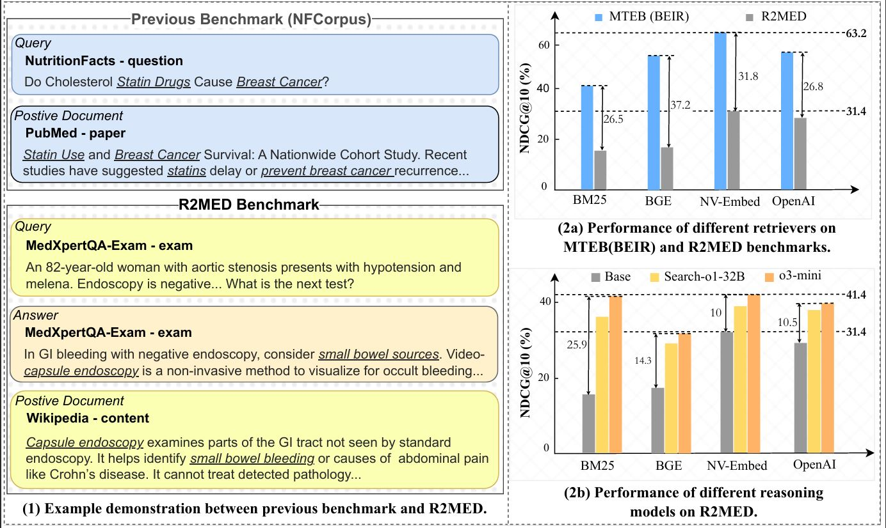

<h1 align="center">R2MED: A Benchmark for Reasoning-Driven Medical Retrieval</h1>

<p align="center">
    <a href="https://arxiv.org/abs/2505.14558">
        
    </a>
    <a href="https://r2med.github.io/">
        
    </a>
    <a href="https://huggingface.co/R2MED" target="_blank">
        
    </a>
    <a href="https://opensource.org/licenses/MIT">
        
    </a>
<!--     <a href="https://github.com/embodied-agent-interface/embodied-agent-interface/tree/main/dataset">
        
    </a> -->
</p>

<p align="center">
    Lei Li, 
    Xiao Zhou, 
    Zheng Liu, 
</p>
<p align="center">Gaoling School of Artificial Intelligence, Renmin University of China</p>
<p align="center">Beijing Academy of Artificial
Intelligence</p>

<p align="center">
    <a href="https://r2med.github.io/" target="_blank">
        
    </a>
</p>

## 🔭 Overview

### R2MED: First Reasoning-Driven Medical Retrieval Benchmark

 **R2MED** is a high-quality, high-resolution information retrieval (IR) dataset designed for medical scenarios. It contains 876 queries with three retrieval tasks, five medical scenarios, and twelve body systems.

| Dataset | #Q | #D | Avg. Pos | Q-Len | D-Len |   
|:-------------------------------|:--------:|:--------:|:--------:|:--------:|:--------:|
| [Biology](https://huggingface.co/datasets/R2MED/Biology) | 103 | 57359   | 3.6     | 115.2   | 83.6    |
| [Bioinformatics](https://huggingface.co/datasets/R2MED/Bioinformatics) | 77  | 47473   | 2.9     | 273.8   | 150.5   |
| [Medical Sciences](https://huggingface.co/datasets/R2MED/Medical-Sciences) | 88  | 34810   | 2.8     | 107.1   | 122.7   |
| [MedXpertQA-Exam](https://huggingface.co/datasets/R2MED/MedXpertQA-Exam) | 97  | 61379   | 3.0     | 233.2   | 154.9   |
| [MedQA-Diag](https://huggingface.co/datasets/R2MED/MedQA-Diag) | 118 | 56250   | 4.4     | 167.8   | 179.7   |
| [PMC-Treatment](https://huggingface.co/datasets/R2MED/PMC-Treatment) | 150 | 28954   | 2.1     | 449.3   | 149.3   |
| [PMC-Clinical](https://huggingface.co/datasets/R2MED/PMC-Clinical) | 114 | 60406   | 2.2     | 182.8   | 480.4   |
| [IIYi-Clinical](https://huggingface.co/datasets/R2MED/IIYi-Clinical) | 129 | 10449   | 3.5     | 602.3   | 1273.0  |

## 🏆 Leaderboard
You could check out the results at R2MED [Leaderboard](https://r2med.github.io/#leaderboard).

## ⚙️  Installation
Note that the code in this repo runs under **Linux** system. We have not tested whether it works under other OS.

1. **Clone this repository:**

    ```bash
    git clone https://github.com/R2MDE/R2MED.git
    cd R2MED
    ```

2. **Create and activate the conda environment:**

    ```bash
    conda create -n r2med python=3.10
    conda activate r2med
    pip install torch==2.4.0 torchvision==0.19.0 torchaudio==2.4.0 --index-url https://download.pytorch.org/whl/cu121
    pip install mteb==1.1.1
    pip install transformers==4.44.2
    pip install vllm==0.5.4
    ```

## 💾 Datasets Preparation

### Download the R2MED dataset:

- **R2MED:** [](https://huggingface.co/R2MED)

    Place all zip files under `./R2MED/dataset` and extract them.

### Data Structure:

For each dataset, the data is expected in the following structure:

```
${DATASET_ROOT} # Dataset root directory, e.g., /home/username/project/R2MED/dataset/Biology
├── query.jsonl        # Query file
├── corpus.jsonl        # Document file
└── qrels.txt         # Relevant label file
```

## 💽 Evaluate
We evaluate 15 representative retrieval models of diverse sizes and architectures. Run the following command to get results:
```
cd ./src
python run.py --mode eval_retrieval --task {task} --retriever_name {retriever_name}
* `--task`: the task/dataset to evaluate. It can take `All` or one of `Biology`,`Bioinformatics`,`economics`,`Medical-Sciences`,`MedXpertQA-Exam`,`MedQA-Diag`,`PMC-Treatment`,`PMC-Clinical`,`IIYi-Clinical`.
* `--retriever_name`: the retrieval model to evaluate. Current implementation supports `bm25`,`contriever`,`medcpt`,`inst-l`,`inst-xl`,`bmr-410m`,`bmr-2b`,`bmr-7b`,`bge`,`e5`,`grit`,`sfr`,`voyage` and `openai`. \
```

We evaluate 3 representative reranker models of diverse sizes and architectures. Run the following command to get results:
```
cd ./src
python run.py --mode eval_reranker --task {task} --retriever_name {retriever_name} --reranker_name {reranker_name} --recall_k {recall_k}
* `--reranker_name`: the reranker model to evaluate. Current implementation supports `bge-reranker`,`monobert`,`rankllama`.
* `--recall_k`: top_k document for reranker. It can take `10` or`100`.\
```

We generate hypothetical documents based on 10+ representative LLMs. Run the following command to get results:
```
cd ./src
python run.py --mode generate_hydoc --task {task} --gar_method {gar_method} --gar_llm {gar_llm}
* `--gar_method`: the generation argument retrieval method. Current implementation supports `hyde`,`query2doc`,`lamer`.
* `--gar_llm`: the llm for generation. Current implementation supports `qwen-7b`,`qwen-32b`,`qwen-72b`,`llama-70b`,`r1-qwen-32b`,`r1-llama-70b`,`huatuo-o1-70b`,`qwq-32b`,`qwen3-32b`,`gpt4`,`o3-mini`.\
```

## 🔍 Add custom model
It is very easy to add evaluate custom models on R2MED. Just adjust the following function in `./src/utils.py`:
```python
class CustomModel:
    def __init__(self, load_mode: str = "Automodel", model_name_or_path: str = None, encode_mode: str = "Base", pooling_method: str = 'cls', normalize_embeddings: bool = True,
            query_instruction_for_retrieval: str = None, document_instruction_for_retrieval: str = None, batch_size: int = 512, max_length: int = 512,cache_path: str = "")

    def encode_queries(self, queries: List[str], **kwargs) -> np.ndarray:

    def encode_corpus(self, corpus: List[Union[Dict[str, str], str]], **kwargs) -> np.ndarray:

    def encode(self, sentences: List[str], **kwargs) -> np.ndarray:
    ...
```

## 📜Reference

If this code or dataset contributes to your research, please kindly consider citing our paper and give this repo ⭐️ :)
```
@article{li2025r2med,
  title={R2MED: A Benchmark for Reasoning-Driven Medical Retrieval},
  author={Li, Lei and Zhou, Xiao and Liu, Zheng},
  journal={arXiv preprint arXiv:2505.14558},
  year={2025}
}
```
